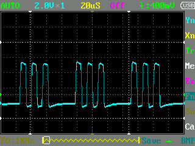

# Index

## Figure 1

  

Oscilloscope-taken 115200 8N1 wave from Arduino TX serial pin

> Oscilloscope-taken 115200 8N1 wave from ECP5 FPGA before it reaches out FT2232H RXD pin

> Arduino bypassing FT2232H IC and reading serial data directly from ECP5 FPGA @115200 8N1

> Arduino IDE display 'A' sequence poured out of ECP5 using raw_serial.v code

